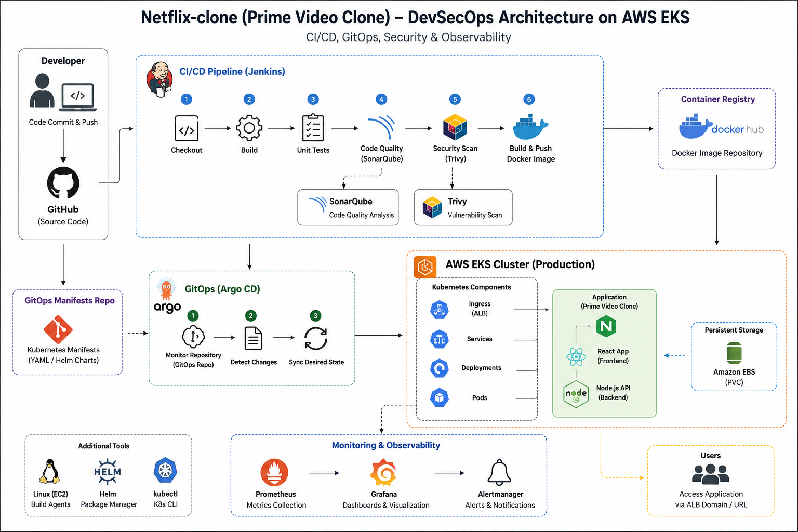
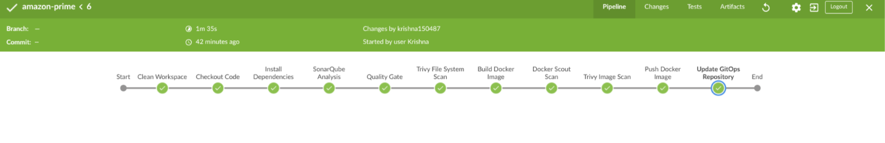
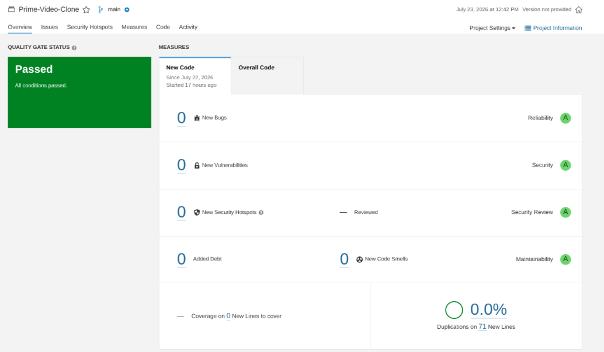
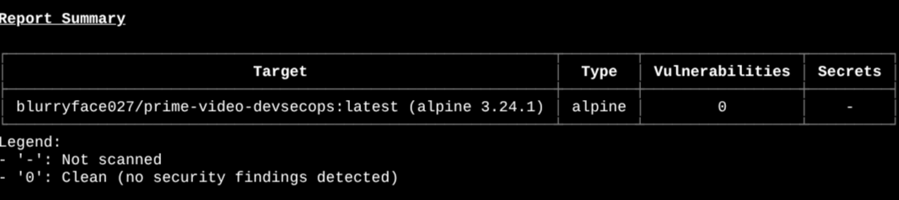
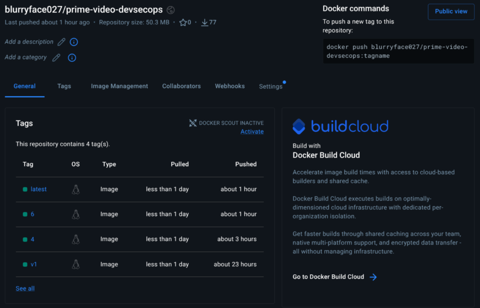
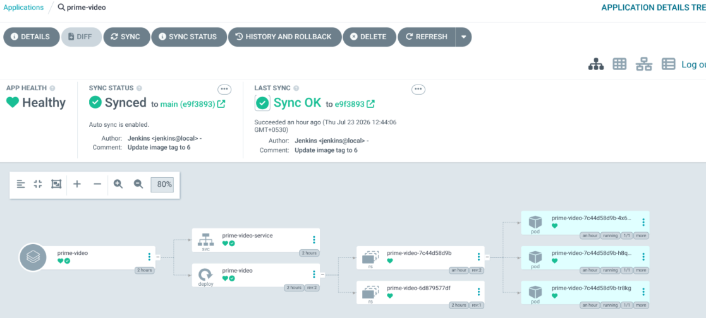
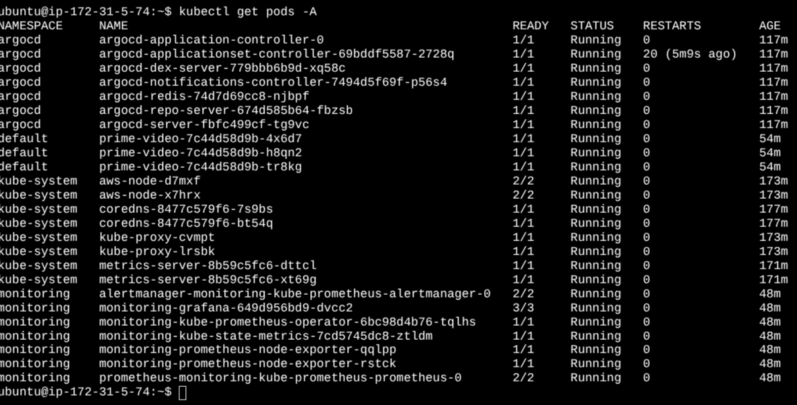
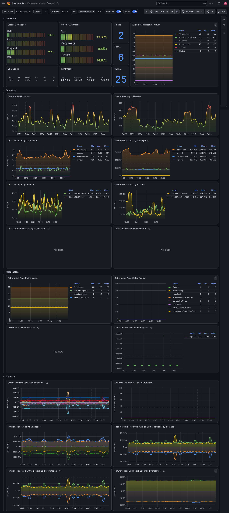
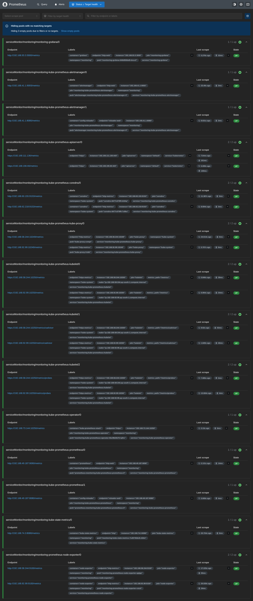
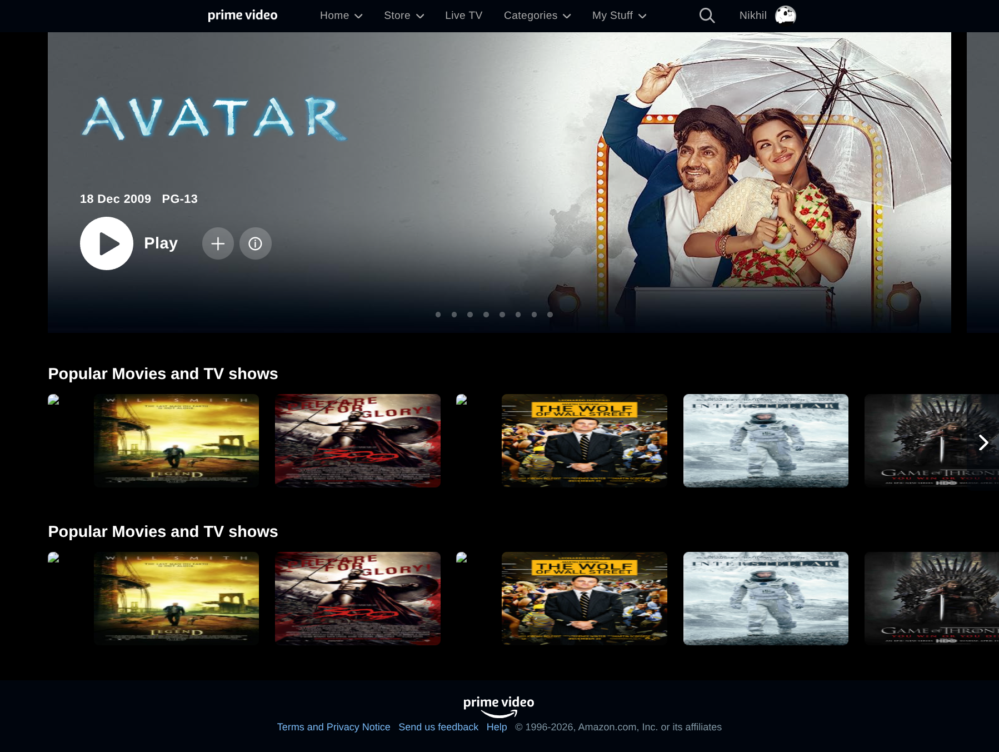

# 🚀 End-to-End DevSecOps CI/CD Pipeline for an Amazon Prime Video Clone using GitOps on Amazon EKS


A production-inspired DevSecOps project demonstrating an automated CI/CD pipeline, GitOps deployment strategy, Kubernetes orchestration, and monitoring on **Amazon EKS**.

# 📖 Project Overview

This project demonstrates how a modern DevSecOps pipeline can automate application delivery from source code to a production-ready Kubernetes environment.

The application is containerized using Docker, scanned for code quality and security vulnerabilities, pushed to Docker Hub, automatically deployed to Amazon EKS using Argo CD and Helm, and continuously monitored with Prometheus and Grafana.

The entire workflow follows GitOps principles where infrastructure changes are driven through Git repositories instead of manual deployments.

# 🏗️ Architecture


> **Note:** This repository contains the application source code and CI/CD pipeline. Kubernetes manifests and Helm charts used by Argo CD are maintained in a separate GitOps repository:
> https://github.com/blurryface027/prime-video-gitops

# 🛠️ Tech Stack

| Category | Technology |
|-----------|------------|
| Cloud Platform | AWS EC2, Amazon EKS |
| Source Control | Git, GitHub |
| CI/CD | Jenkins |
| Containerization | Docker |
| Container Registry | Docker Hub |
| GitOps | Argo CD |
| Kubernetes | Amazon EKS |
| Package Manager | Helm |
| Code Quality | SonarQube |
| Security Scanning | Trivy, Docker Scout |
| Monitoring | Prometheus, Grafana |
| Application | React, Nginx |

# ⚙️ CI/CD & GitOps Workflow

```text
Developer
      │
      ▼
GitHub Repository
      │
      ▼
Jenkins Pipeline
      │
      ├── SonarQube Analysis
      ├── Quality Gate
      ├── Trivy File System Scan
      ├── Docker Build
      ├── Docker Scout Scan
      ├── Trivy Image Scan
      ├── Docker Push
      └── Update GitOps Repository
                  │
                  ▼
              Argo CD
                  │
                  ▼
             Amazon EKS
                  │
                  ▼
        Prime Video Application
                  │
          ┌───────┴────────┐
          ▼                ▼
    Prometheus         Grafana
```

# ✨ Features

- Automated CI/CD Pipeline using Jenkins
- Static Code Analysis with SonarQube
- Quality Gate validation before deployment
- Trivy File System vulnerability scanning
- Docker Scout image analysis
- Trivy Container Image scanning
- Docker image publishing to Docker Hub
- GitOps deployment using Argo CD
- Helm-based Kubernetes deployments
- Amazon EKS orchestration
- Prometheus metrics collection
- Grafana dashboards for monitoring

# 📂 Project Structure

```text
amazon-prime-devsecops
│
├── public/
├── src/
├── Dockerfile
├── Jenkinsfile
├── package.json
├── package-lock.json
├── README.md
└── screenshots/
    ├── architecture.png
    ├── jenkins.png
    ├── sonarqube.png
    ├── trivy.png
    ├── dockerhub.png
    ├── argocd.png
    ├── grafana.png
    └── application.png
```

# 🚀 Deployment Pipeline

```text
Code Commit
      │
      ▼
GitHub Repository
      │
      ▼
Jenkins Pipeline
      │
      ▼
SonarQube Code Analysis
      │
      ▼
Quality Gate
      │
      ▼
Trivy File System Scan
      │
      ▼
Docker Image Build
      │
      ▼
Docker Scout Scan
      │
      ▼
Trivy Image Scan
      │
      ▼
Docker Hub
      │
      ▼
GitOps Repository Update
      │
      ▼
Argo CD Auto Sync
      │
      ▼
Amazon EKS
      │
      ▼
Prime Video Clone
      │
      ▼
Prometheus + Grafana
```

# 📸 Project Screenshots

## Architecture



---

## Jenkins Pipeline



---

## SonarQube Dashboard



---

## Trivy Security Scan



---

## Docker Hub Repository



---

## Argo CD Dashboard



---

## Amazon EKS Cluster



---

## Grafana Dashboard



---

## Prometheus Targets



---

## Running Application



# 📈 Monitoring

Monitoring is implemented using **Prometheus** and **Grafana**.

The monitoring stack provides visibility into:

- Kubernetes Cluster Health
- Worker Node Metrics
- CPU Utilization
- Memory Utilization
- Pod Status
- Network Usage
- Storage Usage
- Container Metrics

Grafana dashboards consume metrics collected by Prometheus, enabling real-time monitoring of the deployed application and Kubernetes cluster.

# 🔒 Security

Security is integrated throughout the CI/CD pipeline.

### SonarQube
- Static Code Analysis
- Code Smells Detection
- Bug Detection
- Maintainability Analysis
- Quality Gate Validation

### Trivy
- Filesystem Vulnerability Scan
- Docker Image Vulnerability Scan

### Docker Scout
- Base Image Analysis
- Package Vulnerability Detection
- Image Recommendations

# 📚 Key Learning Outcomes

During this project I gained practical experience with:

- Building complete CI/CD pipelines using Jenkins
- Containerizing applications using Docker
- Managing container images using Docker Hub
- Implementing GitOps with Argo CD
- Deploying applications on Amazon EKS
- Packaging Kubernetes applications using Helm
- Performing static code analysis using SonarQube
- Performing container security scanning using Trivy
- Image analysis using Docker Scout
- Monitoring Kubernetes workloads using Prometheus & Grafana

# 🔄 GitOps Repository

This project follows the **GitOps** deployment model by separating the application source code from the Kubernetes deployment manifests.

## Repository Structure

### 1. Application Repository

Contains the application source code, Dockerfile, Jenkins pipeline, and CI/CD workflow.

**Repository:**
https://github.com/blurryface027/amazon-prime-devsecops

### 2. GitOps Repository

Contains the Kubernetes manifests and Helm chart monitored by Argo CD.

**Repository:**
https://github.com/blurryface027/prime-video-gitops

---

## GitOps Workflow

1. Developer pushes code to the **Application Repository**.
2. Jenkins executes the CI/CD pipeline.
3. Docker image is built, scanned, and pushed to Docker Hub.
4. Jenkins updates the image tag in the **GitOps Repository**.
5. Argo CD detects the Git commit automatically.
6. Argo CD synchronizes the updated manifests to the Amazon EKS cluster.

This separation follows GitOps best practices by keeping application source code and Kubernetes deployment manifests in independent repositories.

# 👨‍💻 Author

**Krishan Mohan Sharma**

GitHub: https://github.com/blurryface027

LinkedIn: https://www.linkedin.com/in/blurryface027/

## 🙏 Acknowledgements

The frontend application used in this project is based on the open-source **Prime Video Clone** created by **Nikhil Manglik**.

**Original Repository:**
https://github.com/NikhilManglik/Prime-Video-Clone

This repository focuses on implementing a complete **End-to-End DevSecOps, CI/CD, GitOps, Kubernetes, and Monitoring pipeline** around the application, including:

- Jenkins CI/CD Pipeline
- SonarQube Code Analysis
- Trivy Security Scanning
- Docker Scout Image Analysis
- Docker Image Build & Push
- Helm Charts
- Argo CD GitOps Deployment
- Amazon EKS Deployment
- Prometheus Monitoring
- Grafana Dashboards

Full credit for the original frontend application goes to **Nikhil Manglik**.

> **Disclaimer**
>
> This project is intended for educational and portfolio purposes only.
> The application UI is based on an open-source project by Nikhil Manglik. The primary objective of this repository is to demonstrate a production-inspired DevSecOps, GitOps, Kubernetes, and Monitoring workflow.

# ⭐ If you found this project useful

Please consider giving this repository a ⭐ on GitHub.
